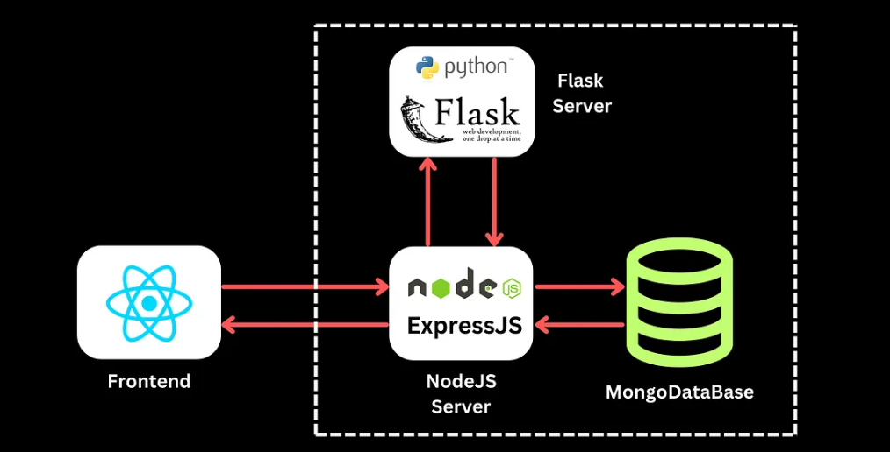

# LINK. – AI-Powered Customer Retention Platform for Telecoms

**LINK.** is a full-stack customer intelligence web platform designed to help telecom operators take action on behavioral insights, predict customer dissatisfaction, and improve retention. This project was developed during **Huawei x Kuwait University Internship Program Summer 2025** and is inspired by Huawei's **SmartCare** solution.

  

## Supervisors

- **Supervisor Trainee:** Dr. Essam Alruqobah  
- **Supervisor Engineer:** Eng. Ali Alsairafi  
- **Supervisor Huawei Site:** Eng. Rahaf Alhasan

## Credits

- Integration guidance inspired by **Lakindu Widuranga Alwis** [Integrating Machine Learning Models into your MERN App](https://masterlwa.medium.com/integrating-machine-learning-models-into-your-mern-app-0e5476b511c1 )

- Login/Signup UI design inspiration from [Ryan Mulligan](https://ryanmulligan.dev)

## Architecture Overview

The frontend sends customer data to the Node.js backend, which forwards it to the Flask microservice for churn prediction. Prediction results are returned to the frontend for chart visualization and user insights.

  

## Machine Learning

LINK. is built to interface with a Python-based churn prediction model trained on IBM’s public Telco Customer Churn dataset. The model uses classification techniques (Logistic Regression, XGBoost) with telecom-inspired feature engineering:

- Custom Metrics:  
  - **KQI**: Key Quality Indicators  
  - **SQM**: Service Quality Metrics  
  - **NPM**: Network Performance Metrics

- ML Stack:  
  - scikit-learn, XGBoost, Optuna (hyperparameter tuning)  
  - Performance metrics: Accuracy, Recall, F1-score

ML Repo: [View Machine Learning Model on GitHub](https://github.com/halacoded/Churn-Prediction-Model-Based-on-Huawei-SmartCare) 

## Backend

The backend of **LINK.** is built with **Node.js**, **Express**, and **MongoDB Atlas**. It powers user authentication, stores prediction data, and integrates with the machine learning model for churn classification.

 BK Repo: [View Backend on GitHub](https://github.com/halacoded/LINK-Backend)

### Features

- Churn prediction integration via REST API  
- OAuth authentication with Google & GitHub  
- MongoDB Atlas for user and prediction data  
- Express routes for handling core platform logic

## Flask Microservice

The LINK. platform integrates with a dedicated **Flask microservice** that delivers real-time churn prediction results. It acts as a bridge between the frontend and the trained machine learning model—analyzing customer feature data and returning churn probability scores for both single and batch requests.

- Built with **Flask**, **scikit-learn**, and **XGBoost**
- Receives API requests from the Node.js backend
- Supports batch prediction through `.csv` file uploads
- Powers the **Predictions Page** for interactive chart rendering

FLASK Repo: [View Microservice on GitHub](https://github.com/halacoded/LINK-FLASK-Microserver)

## Tech Stack

| Layer        | Technology                           |
|--------------|----------------------------------------|
| Frontend     | React.js                              |
| Backend      | Node.js + Express                     |
| Database     | MongoDB                               |
| Design Tools | Figma for UI/UX                       |
| Styling      | Tailwind CSS / CSS Modules            |
| API Layer    | REST endpoints for model results      |
| Deployment   | Netlify                               |

