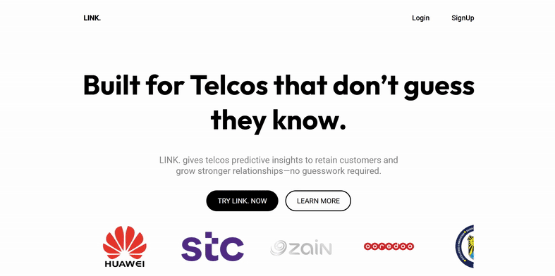

# LINK. – AI-Powered Customer Retention Platform for Telecoms

**LINK.** is a full-stack customer intelligence web platform designed to help telecom operators take action on behavioral insights, predict customer dissatisfaction, and improve retention. This project was developed during **Huawei x Kuwait University Internship Program Summer 2025** and is inspired by Huawei's **SmartCare** solution.

  

## Supervisors

- **Supervisor Trainee:** Dr. Essam Alruqobah  
- **Supervisor Engineer:** Eng. Ali Alsairafi  
- **Supervisor Huawei Site:** Eng. Rahaf Alhasan

## Machine Learning Integration

LINK. is built to interface with a Python-based churn prediction model trained on IBM’s public Telco Customer Churn dataset. The model uses classification techniques (Logistic Regression, XGBoost) with telecom-inspired feature engineering:

- Custom Metrics:  
  - **KQI**: Key Quality Indicators  
  - **SQM**: Service Quality Metrics  
  - **NPM**: Network Performance Metrics

- ML Stack:  
  - scikit-learn, XGBoost, Optuna (hyperparameter tuning)  
  - Performance metrics: Accuracy, Recall, F1-score

🔗 ML Repo: [View Machine Learning Model on GitHub](https://github.com/halacoded/Churn-Prediction-Model-Based-on-Huawei-SmartCare) 

## Tech Stack

| Layer        | Technology                           |
|--------------|----------------------------------------|
| Frontend     | React.js                              |
| Backend      | Node.js + Express                     |
| Database     | MongoDB                               |
| Design Tools | Figma for UI/UX                       |
| Styling      | Tailwind CSS / CSS Modules            |
| API Layer    | REST endpoints for model results      |
| Deployment   | Netlify                               |

